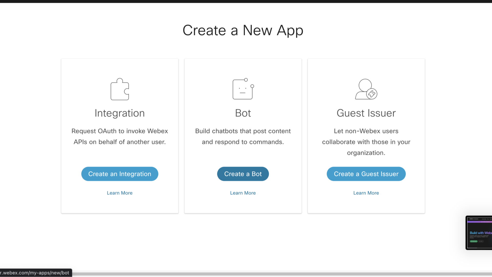
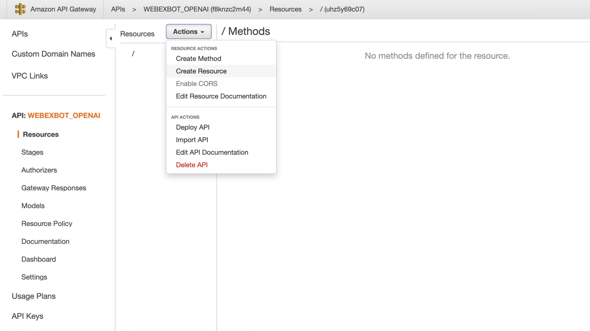
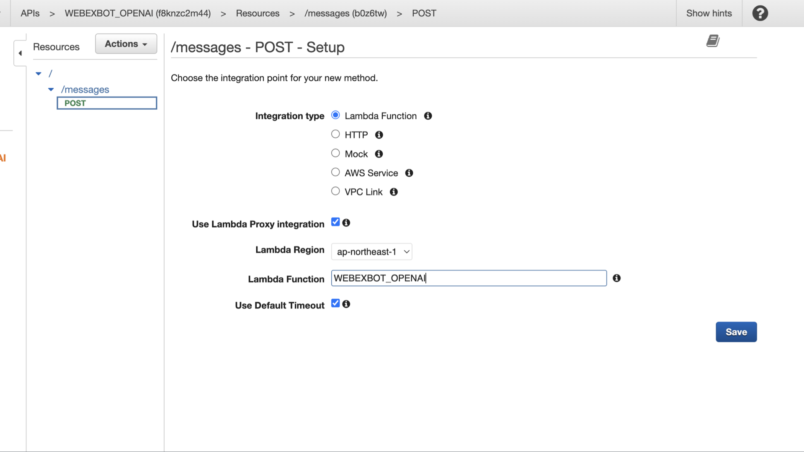
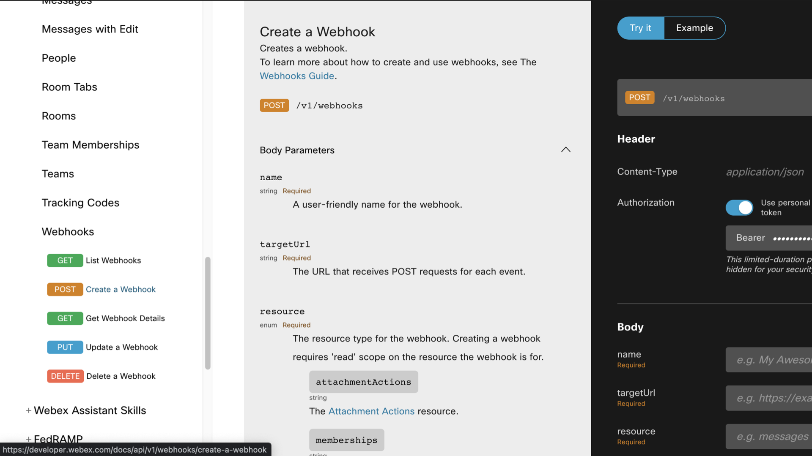
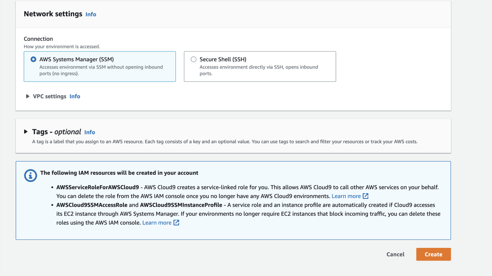

# webexbot-openai
Webex bot working with openai's API

## Overview
In this lab, we will create an interactive webex chatbot using openai's API for responses.

Chatbot logic resides in Lambda, an aws serverless service. We use aws Cloud9 as our development environment. That way we can upload code to Lambda more easily.

If there is an input from the user, Chatbot logic accesses the openai API with that input as a prompt and outputs the response to the user.

## Requirements

- python3.9
- openai
- webexteamssdk
- Cisco webex account
- OpenAI account
- AWS account

> __To use OpenAI's API, we need to create an account and get an API key. This lab uses the $18.00 free trial allotted for the first time.__

> __Each AWS resource is billed.__

## What you do is

1. Create a Webex bot
2. Create AWS Lambda function
3. Create AWS API Gateway
4. Create CIsco Webex webhook
5. Create an AWS Cloud9 instance
6. Upload Deployment package to Lambda

## 1. Create a Webex bot

Create a bot on [Webex for Developers](https://developer.webex.com/). You can go to the creation page from __Start Building Apps__.


Select __Bots__.



Enter __Bot name__ , __Bot username__ , select __Icon__ and click __Add Bot__.


Enter a __Description__ and click __Add Bot__.


Once the bot is created, copy the __Bot access token__ to the editor.


## 2. Create AWS Lambda function

Create from __Create function__.
Select __Author from scratch__ , enter __WEBEXBOT_OPENAI__ for __Function name__, and select __Python 3.9__ for __Runtime__ .


Leave the default settings and click __Create function__.


__Configuration tab__ => __General configuration__ => __Edit__


Increase the __Timeout__ to 1 minute and click __Save__.


__Configuration tab__ => __Environment variables__ <br>
Set the __OpenAI API key__ and the __Bot access token__ obtained when creating the bot in the environment variables. These values are referenced from the bot logic through __Environment variables__.

> OPENAI_SECRET_KEY: { OpenAI API key }

> WEBEX_TEAMS_ACCESS_TOKEN: { Bot access token }


## 3. Create AWS API Gateway

Click __Build__ of __REST API__ from __API Gateway__ creation page.


Select __REST__ for __Choose the protocol__, select __New API__ for __Create new API__, enter any name for __API name__, select __Regional__ for __Endpoint Type__, and click __Create API__.


From __Actions__, __Create Resource__.



Enter __messages__ in __Resource Name__ and click __Create Resource__.


From __Actions__, __Create Method__.


Select __POST__.


Set __Integration Type__ to __Lambda Function__, enable __Use Lambda Proxy Integration__, select your region for __Lambda Region__, and set the name of the created Lambda function to __Lambda Function__.



From __Actions__, __Deploy API__.


Select a __New Stage__ and enter an arbitrary stage name for __Stage name__. Click __Deploy__.


Copy the __Invoke URL__ of the POST method to the editor.


## 4. Create CIsco Webex webhook

Log in to [Webex for Developers](https://developer.webex.com/) and from the left pane of the [Documentation](https://developer.webex.com/docs) page do the following:<br>
__APIs__ => __Webex APIs__ => __Messaging__ => __Reference__ => __Webhooks__ => __POST Create a Webhook__



Enter the parameters in the right pane as shown below.

> <dl>
>   <dt><strong>Authorization:</strong></dt>
>   <dd>Disable <strong>Use personal access token</strong> and paste the bot access token you copied when creating the bot.</dd>
>   <dt><strong>name:</strong></dt>
>   <dd>Enter any webhook name.</dd>
>   <dt><strong>targetUrl:</strong></dt>
>   <dd>Paste the <strong>Invoke URL</strong> of the POST method that you copied when creating API Gateway.</dd>
>   <dt><strong>resources:</strong></dt>
>   <dd>Enter <strong>messages</strong>.</dd>
>   <dt><strong>events:</strong></dt>
>   <dd>Enter <strong>created</strong>.</dd>
> <dl>


## 5. Create an AWS Cloud9 instance

Enter __Name__ from the Cloud9 creation screen of the management console, and select __New EC2 instance__ in __Environment type__.


Select __t2.micro__ for __Instance type__ and __Ubuntu Server 18.04 LTS__ for __Platform__.


Click __Create__. Since it can be created, start the IDE from __Open in Cloud9__.



## 6. Upload Deployment package to Lambda

Upload the deployment package containing Bot logic and related libraries to Lambda in the Cloud9 terminal as follows.

### Define default region as environment variable

```shell-session
export DEFAULT_REGION=ap-northeast-1
```

### Clone the repository

```shell-session
git clone https://github.com/masanobu48154/webexbot-openai.git
```

### Go into the webexbot-openai directory

```shell-session
cd webexbot-openai/
```

### Run upload_package.sh.

```shell-session
bash upload_package.sh 
```

```shell-session
cloud9:~/environment $ export DEFAULT_REGION=ap-northeast-1
cloud9:~/environment $ git clone https://github.com/masanobu48154/webexbot-openai.git
Cloning into 'webexbot-openai'...
remote: Enumerating objects: 71, done.
remote: Counting objects: 100% (71/71), done.
remote: Compressing objects: 100% (59/59), done.
remote: Total 71 (delta 23), reused 57 (delta 12), pack-reused 0
Unpacking objects: 100% (71/71), done.
cloud9:~/environment $ cd webexbot-openai/
cloud9:~/environment/webexbot-openai (main) $ bash upload_package.sh 
Sending build context to Docker daemon  16.61MB
Step 1/2 : FROM python:3.9
3.9: Pulling from library/python
f2f58072e9ed: Pull complete 
5c8cfbf51e6e: Pull complete 
aa3a609d1579: Pull complete 
094e7d9bb04e: Pull complete 
2cbfd734f382: Pull complete 
aa86ac293d0f: Pull complete 
ea442e3d4174: Pull complete 
c662908b49d7: Pull complete 
f7e80cce9b62: Pull complete 
Digest: sha256:929da7c4e1285e844e70e901267059f63ea958778695a867111a77eaf09700ff
Status: Downloaded newer image for python:3.9
 ---> 7d357ce6a803
Step 2/2 : RUN mkdir /temp   && cd /temp   && mkdir package   && pip3 install --target ./package openai   && pip3 install --target ./package webexteamssdk
 ---> Running in df0d0e14bced
Collecting openai
  Downloading openai-0.25.0.tar.gz (44 kB)
     ━━━━━━━━━━━━━━━━━━━━━━━━━━━━━━━━━━━━━━━━ 44.9/44.9 KB 7.2 MB/s eta 0:00:00
  Installing build dependencies: started


(snip)


{
    "FunctionName": "WEBEXBOT_OPENAI",
    "FunctionArn": "arn:aws:lambda:ap-northeast-1:012345678901:function:WEBEXBOT_OPENAI",
    "Runtime": "python3.9",
    "Role": "arn:aws:iam::012345678901:role/service-role/WEBEXBOT_OPENAI-role-wseuyy5t",
    "Handler": "lambda_function.lambda_handler",
    "CodeSize": 43335723,
    "Description": "",
    "Timeout": 3,
    "MemorySize": 128,
    "LastModified": "2022-12-21T05:30:32.000+0000",
    "CodeSha256": "E4r+hTtnD8/qcXeqY57yMqhzr29nbeXzwkQFzqTPqk8=",
    "Version": "$LATEST",
    "TracingConfig": {
        "Mode": "PassThrough"
    },
    "RevisionId": "1f795f02-0db7-4fb2-8d34-012345678901",
    "State": "Active",
    "LastUpdateStatus": "InProgress",
    "LastUpdateStatusReason": "The function is being created.",
    "LastUpdateStatusReasonCode": "Creating",
    "PackageType": "Zip",
    "Architectures": [
        "x86_64"
    ],
    "EphemeralStorage": {
        "Size": 512
    }
}

```