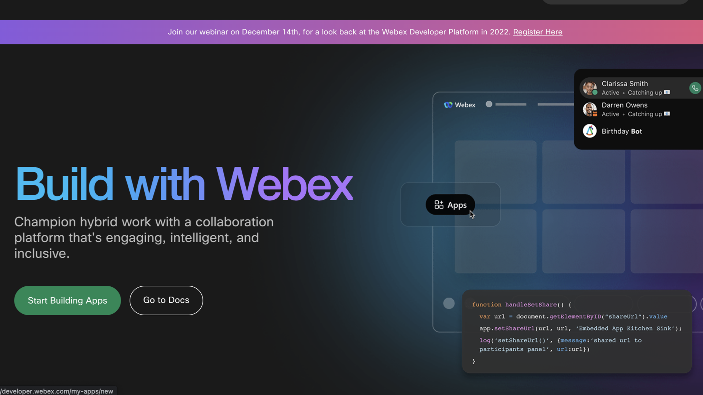
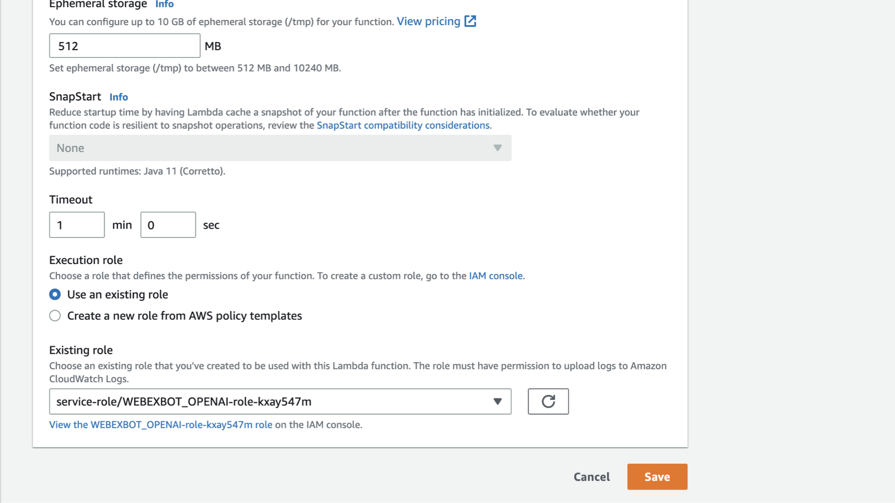
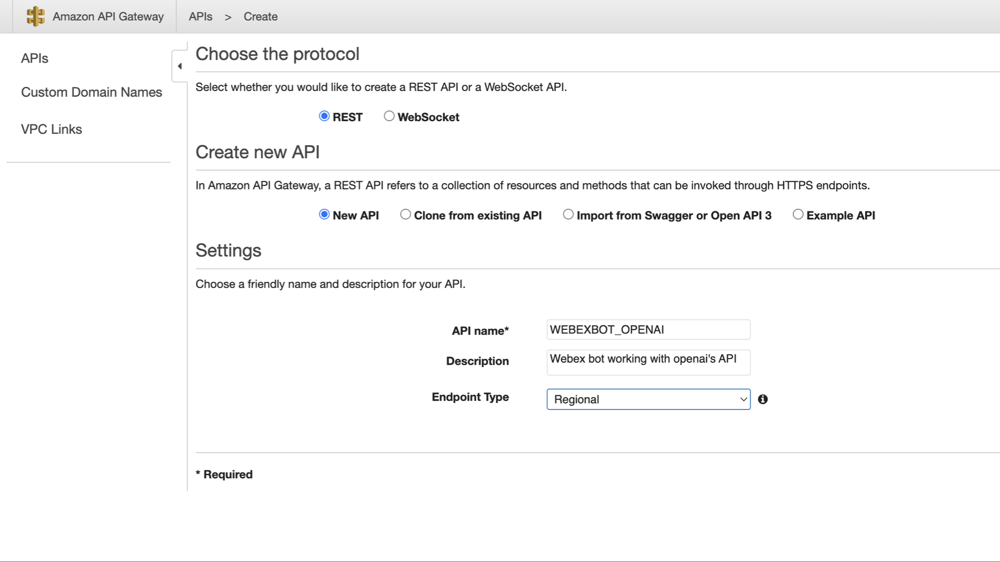
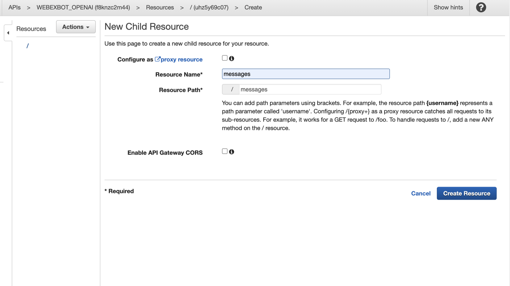
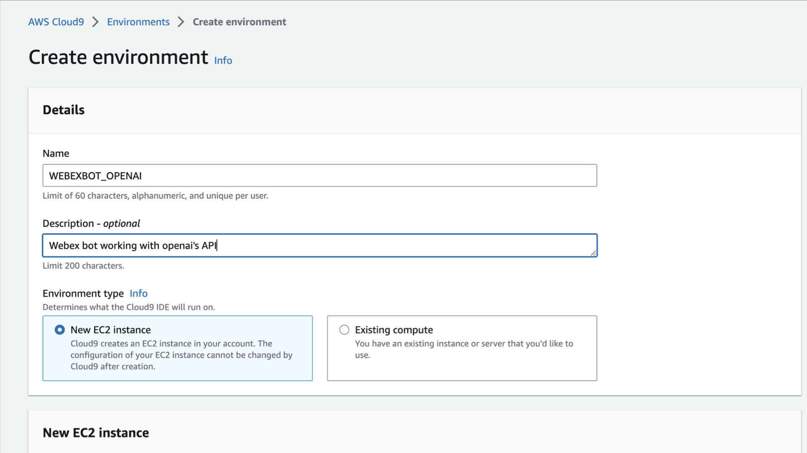

# webexbot-openai
Webex bot working with openai's API

## Overview
In this lab, we will create an interactive webex chatbot using openai's API for responses.

Chatbot logic resides in Lambda, an aws serverless service. We use aws Cloud9 as our development environment. That way we can upload code to Lambda more easily.

If there is an input from the user, Chatbot logic accesses the openai API with that input as a prompt and outputs the response to the user.

## Requirements

- python3.9
- openai
- webexteamssdk
- Cisco webex account
- OpenAI account
- AWS account

> __To use OpenAI's API, we need to create an account and get an API key. This lab uses the $18.00 free trial allotted for the first time.__

> __Each AWS resource is billed.__

## What you do is

1. Create a Webex bot
2. Create AWS Lambda function
3. Create AWS API Gateway
4. Create CIsco Webex webhook
5. Create an AWS Cloud9 instance
6. Upload Deployment package to Lambda

## 1. Create a Webex bot

Create a bot on [Webex for Developers](https://developer.webex.com/). You can go to the creation page from __Start Building Apps__.

Select __Bots__.

Enter __Bot name__ , __Bot username__ , select __Icon__ and click __Add Bot__.

Enter a __Description__ and click __Add Bot__.

Once the bot is created, copy the __Bot access token__ to the editor.

## 2. Create AWS Lambda function

Create from __Create function__.
Select __Author from scratch__ , enter __Function name__ , and select __Python 3.9__ for __Runtime__ .

Leave the default settings and click __Create function__.

__Configuration tab__ => __General configuration__ => __Edit__

Increase the __Timeout__ to 1 minute and click __Save__.

__Configuration tab__ => __Environment variables__  
Set the __OpenAI API key__ and the __Bot access token__ obtained when creating the bot in the environment variables. These values are referenced from the bot logic through __Environment variables__.

> OPENAI_SECRET_KEY: { OpenAI API key }

> WEBEX_TEAMS_ACCESS_TOKEN: { Bot access token }

## 3. Create AWS API Gateway

Click __Build__ of __REST API__ from __API Gateway__ creation page.

Select __REST__ for __Choose the protocol__, select __New API__ for __Create new API__, enter any name for __API name__, select __Regional__ for __Endpoint Type__, and click __Create API__.

From __Actions__, __Create Resource__.

Enter __messages__ in __Resource Name__ and click __Create Resource__.

From __Actions__, __Create Method__.

Select __POST__.

Set __Integration Type__ to __Lambda Function__, enable __Use Lambda Proxy Integration__, select your region for __Lambda Region__, and set the name of the created Lambda function to __Lambda Function__.

From __Actions__, __Deploy API__.

Select a __New Stage__ and enter an arbitrary stage name for __Stage name__. Click __Deploy__.

Copy the __Invoke URL__ of the POST method to the editor.

## 4. Create CIsco Webex webhook

